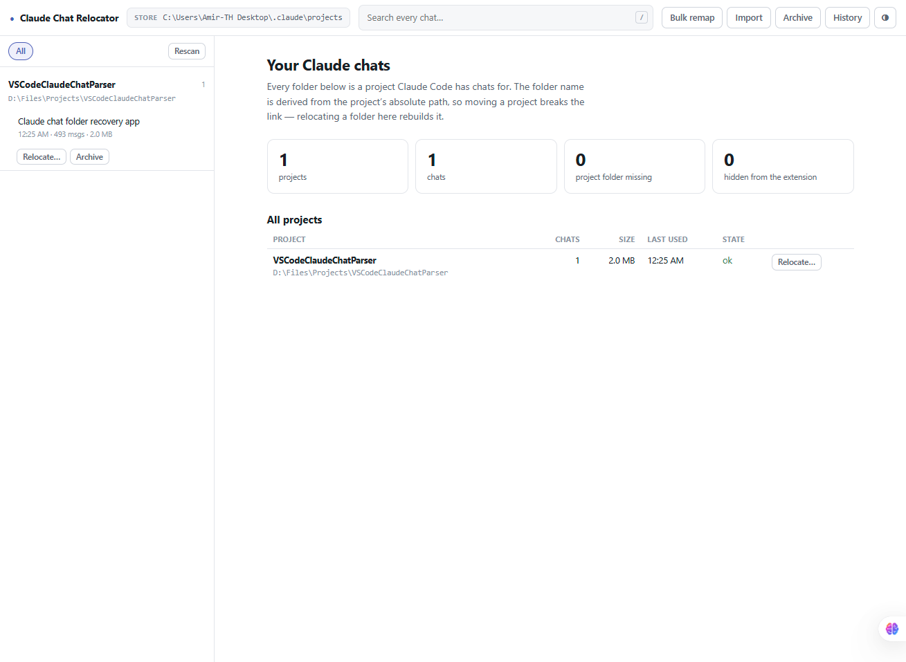
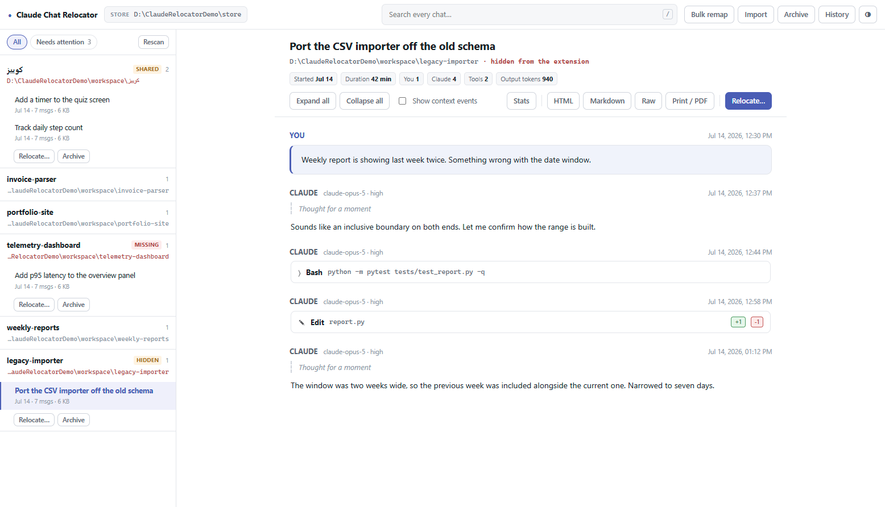
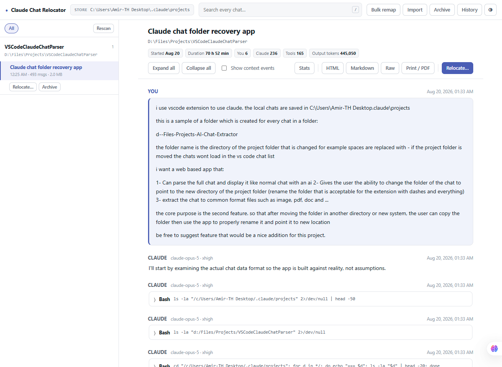

<div align="center">

# Claude Chat Relocator

**Your Claude Code chats disappeared after you moved a project folder.
This puts them back.**

[](https://github.com/amirtavakolihaghighi/claude-chat-relocator/actions/workflows/ci.yml)
[](LICENSE)
[](https://nodejs.org)
[](test/)

Read, relocate and export the chat history the Claude Code VS Code extension
keeps in `~/.claude/projects`.

[What it does](#what-it-does) · [Install](#install) ·
[Why chats vanish](#the-problem) ·
[Safety](#safety) · [Docs](docs/)

<br>



</div>

---

## The problem

Claude Code names each project's chat folder after the project's absolute path:

```
D:\Files\Projects\MyApp   ->   d--Files-Projects-MyApp
```

The extension recomputes that name from whatever workspace you have open. Move
the project to `E:\Dev\MyApp` and it starts looking for `e--Dev-MyApp`, which
does not exist. Your chats are still on disk, in a folder nothing looks at any
more. Nothing was deleted — it just cannot be found.

Fixing it properly means changing **two** things together:

1. the folder name, which is what the extension looks up, and
2. the `cwd` field stamped on nearly every record *inside* the `.jsonl` files.

Renaming the folder alone is the common half-fix. This tool does both, shows
you exactly what it will change first, backs everything up, and can undo it.

## What it does

### Relocate chats to a project's new home
Choose a project, say where it lives now. You get a dry run — the new folder
name, how many recorded paths change, in which files — before anything is
touched. Then it backs up the folder, rewrites the paths, and renames it.

### Find what is already broken
The dashboard separates three failures that look alike but are not:

| | Meaning |
|---|---|
| **missing** | The project folder these chats point at is gone from this machine. |
| **hidden** | The folder's name no longer encodes its recorded path, so the extension never looks there. Chats sitting in plain sight, invisible. |
| **shared** | Two different projects landed in one folder because their paths encode identically. See [ENCODING.md](docs/ENCODING.md). |



Every badge above is the app reading a real store and reporting what it found.
You can reproduce this exact state on your own machine with
`node scripts/demo-store.js`, which builds a throwaway store and tells you what
to delete afterwards.

### Read your chats properly
Full transcript rendering: markdown, syntax-highlighted code, real unified
diffs for every edit, separated stdout and stderr, todo lists, inline
screenshots. Tool calls collapse to a single line so the conversation stays
readable, and expand when you want the detail.



### Move everything at once
Set up a new machine, or moved your whole projects directory? Give the old and
new parent folder — `D:\Files\Projects` → `E:\Dev` — and every chat folder
underneath is repointed in one pass.

### Search every chat at once
Full-text across all sessions: your messages, Claude's replies, tool commands,
tool output. Click a result to open that chat at that message.

### Export
- **Self-contained HTML** — one file, images inlined, opens offline on any
  machine, prints to a clean PDF with `Ctrl+P`
- **Markdown** — fenced code and `diff` blocks, good for repos and issues
- **Raw `.jsonl`** — the original file, byte for byte
- **JSON** — the parsed transcript, if you want to script against it

### Carry chats between machines
Export a `.zip` with a manifest of each project's real path. Import it
elsewhere, say where each project lives now, and the folders are rebuilt with
correct names and rewritten paths. Hand-made zips work too — the original paths
are recovered from the files themselves.

## Install

### If you are not a developer

1. Install [Node.js](https://nodejs.org) — download the **LTS** version and
   click through the installer. This is a one-time step.
2. Download this project: green **Code** button above → **Download ZIP** →
   unpack it somewhere.
3. Double-click **`start.cmd`** (Windows) or **`start.sh`** (macOS/Linux).

The first launch spends a minute fetching libraries, then your browser opens.
Leave the black console window alone while you work; closing it stops the app.

### If you are

```bash
git clone https://github.com/amirtavakolihaghighi/claude-chat-relocator.git
cd claude-chat-relocator
npm install
npm start
```

Opens `http://127.0.0.1:4317`. Node 20+.

```bash
PORT=4400 npm start                  # different port
NO_OPEN=1 npm start                  # do not launch a browser
CLAUDE_PROJECTS_DIR=/some/copy npm start   # read a store from elsewhere
npm test                             # 74 tests, no real data touched
```

## Safety

This tool edits the only copy of your chat history, so it is built to be
boring about it:

- **Dry run first.** Nothing is written until you approve a plan.
- **Full backup** to `~/.claude-chat-relocator/backups/` before any change.
- **Undo**, restoring from that backup. Verified byte-identical by test.
- **Surgical edits.** `.jsonl` files are edited as text, replacing only the
  `cwd` string. Records are never re-parsed and re-serialised, so no other byte
  can shift. A test asserts exactly this.
- **Temp file then rename**, so an interrupted write cannot truncate a file.
- **Collisions refused**, never silently merged.
- **A warning if a file changed in the last 90 seconds** — that chat may be
  open in VS Code right now.

> **Close VS Code before relocating a project you have open there.** The
> extension can write the old paths back underneath you.

Historical path references — old paths inside tool output and edit snippets —
are deliberately left alone. They record what happened at the time and are not
configuration. The dry run tells you how many there are.

### Privacy

Everything runs on your machine. No telemetry, no update checks, no network
calls of any kind. The server binds to `127.0.0.1` only and has no
authentication, so do not expose it to a network — see [SECURITY.md](SECURITY.md).

## Non-Latin paths

Persian, Arabic, Cyrillic and CJK paths work correctly. The encoding replaces
each character with one dash:

```
C:\Quiz\کوییز\4- Working   ->   c--Quiz-------4--Working
```

There are three consequences worth knowing — long folder names, unrelated
projects that can collide into one folder, and Unicode normalisation. The app
detects and warns about all three. [ENCODING.md](docs/ENCODING.md) explains
them.

## Documentation

| | |
|---|---|
| [docs/ENCODING.md](docs/ENCODING.md) | The folder-naming rule, why it is one-way, and how non-Latin paths behave. Read this one even if you never run the app. |
| [docs/ARCHITECTURE.md](docs/ARCHITECTURE.md) | How the pieces fit, the record format, and how writes are kept safe. |
| [docs/PACKAGING.md](docs/PACKAGING.md) | Options for shipping this to people who do not have Node. |
| [CONTRIBUTING.md](CONTRIBUTING.md) | Setup, conventions, and the one rule that matters. |
| [SECURITY.md](SECURITY.md) | Threat model and how to report a vulnerability. |

## Doing it by hand

If you would rather not run anything: rename the folder in
`~/.claude/projects` using the rule above, then search-and-replace the old
`cwd` value inside every `.jsonl` in it. Back it up first — and do not skip the
second step.

## Compatibility

Built against the on-disk format used by the Claude Code VS Code extension as
of August 2026, verified across a real store of nine sessions and seven
projects. The format is Anthropic's and undocumented; it may change. Unknown
record types and unknown tools degrade gracefully rather than failing, and a
corrupt line is skipped and reported rather than aborting the parse.

Not affiliated with or endorsed by Anthropic.

## License

[MIT](LICENSE) © 2026 Amir Tavakoli Haghighi
